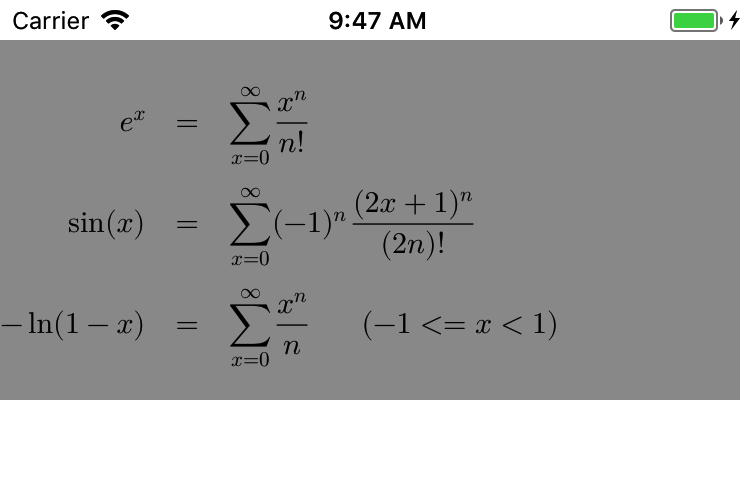
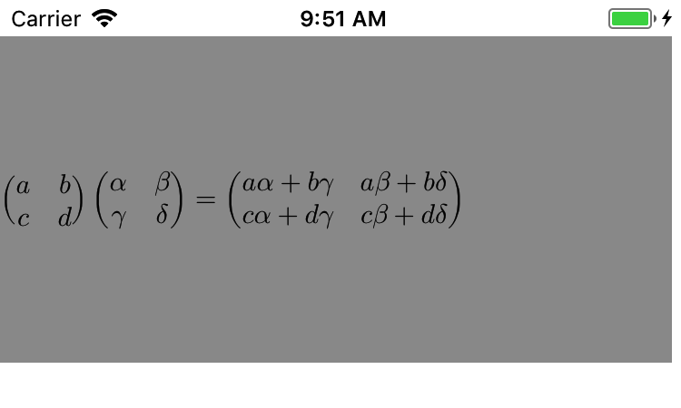

### Ever wanted to display LaTeX math formulae in C# but cannot find any tool to help you? Here is what you may be looking for.


CSharpMath is a C# port of the wonderful [iosMath LaTeX engine](https://github.com/kostub/iosMath).

Current NuGet version|Current stable version|Commits since last version
-|-|-
||

It is now working in most cases. Some examples are below.

# Platforms

Ironically enough, the first front end was iOS (CSharpMath.Ios).
As development continued, Xamarin.Forms (CSharpMath.Forms)<!-- and Windows environments--> is now supported via SkiaSharp (CSharpMath.SkiaSharp) as of 0.1.0.

# Usage and Examples

To get started, do something like this:

### 1. CSharpMath.Ios

```cs
var latexView = IosMathLabels.MathView(@"x = -b \pm \frac{\sqrt{b^2-4ac}}{2a}", 15);
latexView.ContentInsets = new UIEdgeInsets(10, 10, 10, 10);
var size = latexView.SizeThatFits(new CoreGraphics.CGSize(370, 180));
latexView.Frame = new CoreGraphics.CGRect(0, 20, size.Width, size.Height);
someSuperview.Add(latexView);
```

[See an example project](CSharpMath.IosExample)
      







      
### 2. CSharpMath.Forms

```xaml
<ContentPage xmlns="http://xamarin.com/schemas/2014/forms"
             xmlns:math="clr-namespace:CSharpMath.Forms;assembly=CSharpMath.Forms"
             x:Class="Namespace.Class">
    <math:FormsMathView x:Name="View" HorizontalOptions="FillAndExpand" VerticalOptions="FillAndExpand">
        \frac\sqrt23
    </math:FormsMathView>
</ContentPage>
```
or you can use the prehistoric way:
```cs
var view = new FormsMathView();
view.HorizontalOptions = view.VerticalOptions = LayoutOptions.FillAndExpand;
view.LaTeX = @"\frac\sqrt23";
someLayout.Children.Add(view);
```

[See an example project](CSharpMath.Forms.Example)
    
iOS | Android | Windows UWP
----|---------|------------
 |  |  

# [Documentation](https://github.com/verybadcat/CSharpMath/wiki/Documentation-of-public-facing-APIs-of-CSharpMath.Rendering,-CSharpMath.SkiaSharp-and-CSharpMath.Forms)

# Extending to more platforms

There are a few ways to extend this to more platforms:
(Hopefully, you would not need to touch the core typesetting engine. If you do, we would consider that a bug.)

### 1. Branching off from CSharpMath (the project)

This path would require the most effort to implement, but allows you to plug in any font library and graphics library.

You would have to define your own [TypesettingContext](CSharpMath/FrontEnd/TypesettingContext.cs) and write an implementation of [IGraphicsContext](CSharpMath/FrontEnd/IGraphicsContext.cs).

The TypesettingContext in turn has several components, including choosing a font.

### 2. Forking from CSharpMath.Rendering

As CSharpMath.Rendering provides font lookup through [the Typography library](https://github.com/LayoutFarm/Typography), you would only need to write adapter classes to connect this library to your chosen graphics library.

You would have to implement [ICanvas](CSharpMath.Rendering/Drawing/ICanvas.cs) and feed it into the Draw method of [MathPainter](CSharpMath.Rendering/MathPainter.cs).

### 3. Referencing CSharpMath.SkiaSharp

You can extend this library to other SkiaSharp-supported platforms by feeding the SKCanvas given in the OnPaintSurface override of a SkiaSharp view into the Draw method of [SkiaMathPainter](CSharpMath.SkiaSharp/SkiaMathPainter.cs).

### 4. Building on top of CSharpMath.Apple

You can use this library on other appleOSes by making use of [AppleMathView](CSharpMaath.Apple/AppleMathView.cs).
      
# Project needs

We need more contributors! Maybe you can contribute something to this repository. Whether they are bug reports, feature proposals or pull requests, you are welcome to send them to us. We are sure that we will take a look at them!

Here is an idea list if you cannot think of anything right now:
- A new example for the Exmple projects (please open pull requests straight away)
- A new LaTeX command (please link documentation of it)
- A new front end (please describe what it is and why should it be supported)
- A new math syntax (please describe what it is and why should it be supported)

# License

CSharpMath is licensed by [the MIT license](LICENSE).

Dependency|Used by|License
-|-|-
latin-modern-math font|CSharpMath.Ios, CSharpMath.Rendering|[GUST Font License](http://www.gust.org.pl/projects/e-foundry/licenses/GUST-FONT-LICENSE.txt/view)
Typography project|CSharpMath.Rendering|[MIT](https://github.com/LayoutFarm/Typography/blob/master/LICENSE.md)

# Authors

[@verybadcat](https://github.com/verybadcat)

[@Happypig375](https://github.com/Happypig375)

[@charlesroddie](https://github.com/charlesroddie)

Thanks for reading.
<br/><br/><br/><br/><br/><br/><br/><br/><br/><br/><br/><br/><br/><br/><br/><br/><br/><br/><br/><br/><br/><br/><br/><br/><br/><br/><br/><br/><br/><br/><br/><br/><br/><br/><br/><br/><br/><br/><br/><br/><br/><br/><br/><br/><br/><br/><br/><br/><br/><br/><br/><br/><br/><br/><br/><br/><br/><br/><br/><br/><br/><br/><br/><br/><br/><br/><br/><br/><br/><br/><br/><br/><br/>
You can take a look at the code now.<br/><br/><br/><br/><br/><br/><br/><br/><br/><br/><br/><br/><br/><br/><br/><br/><br/><br/><br/><br/><br/><br/><br/><br/><br/><br/><br/><br/><br/><br/><br/><br/><br/><br/><br/><br/><br/><br/><br/><br/><br/><br/><br/><br/><br/><br/><br/><br/><br/><br/><br/><br/><br/><br/><br/><br/><br/><br/><br/><br/><br/><br/><br/><br/><br/><br/><br/><br/><br/><br/><br/><br/><br/><br/><br/><br/><br/><br/><br/><br/><br/><br/><br/><br/><br/><br/><br/><br/><br/><br/><br/><br/><br/><br/><br/><br/><br/><br/><br/><br/><br/><br/><br/><br/><br/><br/><br/><br/><br/><br/><br/><br/>
Really, there is nothing here.<br/><br/><br/><br/><br/><br/><br/><br/><br/><br/><br/><br/><br/><br/><br/><br/><br/><br/><br/><br/><br/><br/><br/><br/><br/><br/><br/><br/><br/><br/><br/><br/><br/><br/><br/><br/><br/><br/><br/><br/><br/><br/><br/><br/><br/><br/><br/><br/><br/><br/><br/><br/><br/><br/><br/><br/><br/><br/><br/><br/><br/><br/><br/><br/><br/><br/><br/><br/><br/><br/><br/><br/><br/><br/><br/><br/><br/><br/><br/><br/><br/><br/><br/><br/><br/><br/><br/><br/><br/><br/><br/><br/><br/><br/><br/><br/><br/><br/><br/><br/><br/><br/><br/><br/><br/><br/><br/><br/><br/><br/><br/><br/><br/><br/><br/><br/><br/><br/><br/><br/><br/><br/><br/><br/><br/><br/><br/><br/><br/><br/><br/><br/><br/><br/><br/><br/><br/><br/><br/><br/><br/><br/><br/><br/><br/><br/><br/><br/><br/><br/><br/><br/><br/><br/><br/><br/><br/><br/><br/><br/><br/><br/><br/><br/><br/><br/><br/><br/>
I bet you scrolled past and came back to read me.<br/><br/><br/><br/><br/><br/><br/><br/><br/><br/><br/><br/><br/><br/><br/><br/><br/><br/><br/><br/><br/><br/><br/><br/><br/><br/><br/><br/><br/><br/><br/><br/><br/><br/><br/><br/><br/><br/><br/><br/><br/><br/><br/><br/><br/><br/><br/><br/><br/><br/><br/><br/><br/><br/><br/><br/><br/><br/><br/><br/><br/><br/><br/><br/><br/><br/><br/><br/><br/><br/><br/><br/><br/><br/><br/><br/><br/><br/><br/><br/><br/><br/><br/><br/><br/><br/><br/><br/><br/><br/><br/><br/><br/><br/><br/><br/><br/><br/><br/><br/>
Will you stop scrolling?<br/><br/><br/><br/><br/><br/><br/><br/><br/><br/><br/><br/><br/><br/><br/><br/><br/><br/><br/><br/><br/><br/><br/><br/><br/><br/><br/><br/><br/><br/><br/><br/><br/><br/><br/><br/><br/><br/><br/><br/><br/><br/><br/><br/><br/><br/><br/><br/><br/><br/><br/><br/><br/><br/><br/><br/><br/><br/><br/><br/><br/><br/><br/><br/><br/><br/><br/><br/><br/><br/><br/><br/><br/><br/><br/><br/><br/><br/><br/><br/><br/><br/><br/><br/><br/><br/><br/><br/><br/><br/><br/><br/><br/><br/><br/><br/><br/>
Ok, fine... I give up.

###### A sneak peek at the future?

Shhh... Don't tell anybody!


0.2.0: MathML?
0.3.0: AsciiMath?
0.4.0: Infix?

0.4.0: Math evaluation??
0.5.0: Handwritten math recognition???
